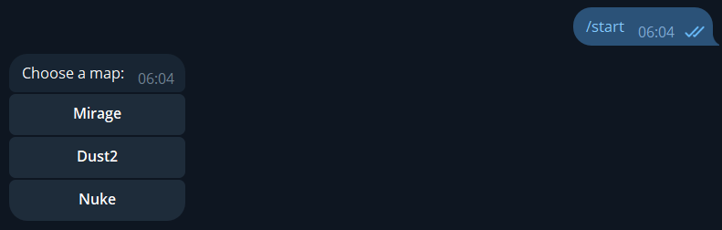
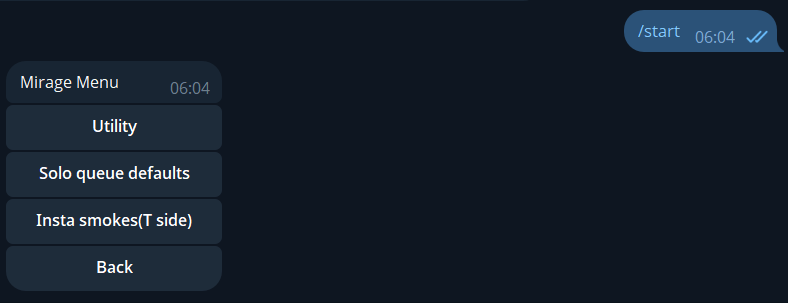
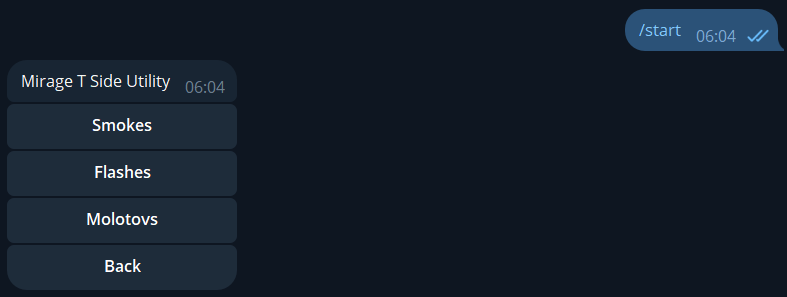
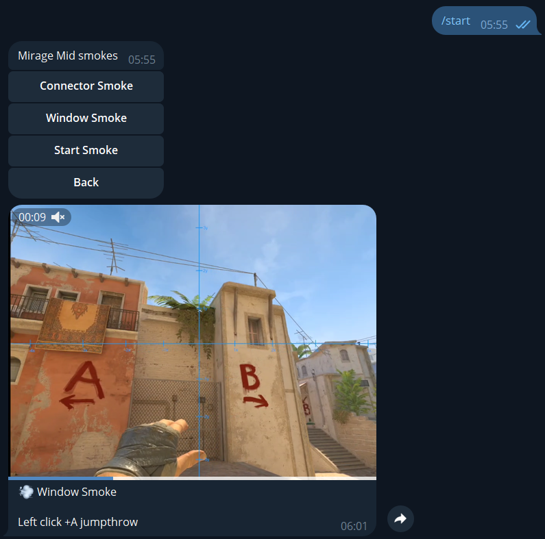

# CS2 Utility Guide Telegram Bot

Final project for the **Introduction to Programming 2** course.

## Project Description

This project is a Telegram bot that helps Counter-Strike 2 players learn useful grenade lineups. The bot uses inline keyboards to guide users through maps, sides, utility types, and specific grenade videos.

## Features

- Start menu with map selection.
- Inline keyboard navigation.
- Mirage utility menu.
- T-side smoke lineups for Mirage.
- Smoke categories for A site, Mid, and B site.
- Solo queue default utility examples for Mirage.
- Video delivery directly in Telegram.
- JSON-based grenade data storage.

## Technologies Used

- Python
- aiogram 3
- Telegram Bot API
- JSON
- MP4 media files

## Installation Instructions

1. Clone the repository:

```bash
git clone https://github.com/mansurahmetov33-gif/final.git
cd final
```

2. Create and activate a virtual environment:

```bash
python -m venv .venv
```

Windows:

```bash
.venv\Scripts\activate
```

macOS/Linux:

```bash
source .venv/bin/activate
```

3. Install dependencies:

```bash
pip install aiogram
```

4. Add your Telegram bot token in `config.py`:

```python
TOKEN = "YOUR_TELEGRAM_BOT_TOKEN"
```

## How to Run the Project

Run the main file:

```bash
python main.py
```

After successful launch, the console should display:

```text
Bot started
```

Then open the bot in Telegram and send the `/start` command.

## How to Use

1. Open the bot in Telegram.
2. Send the `/start` command.
3. Choose a map.
4. Select a utility category.
5. Pick a grenade lineup.
6. The bot sends a video guide.

## Screenshots

### Start Menu


### Mirage Menu


### Utility Category Menu


### Video Response


## Team Members

by Akhmetov Mansur and Yerkin Alnur
